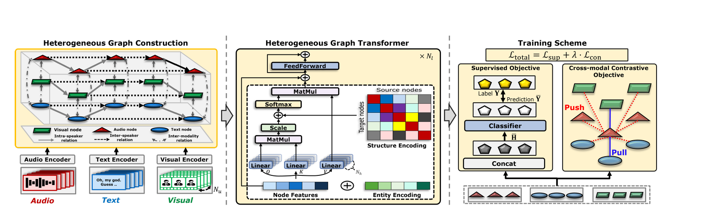

# [ICASSP 2026 POSTER] JOINT GRAPH-BASED MODALITY ALIGNMENT FOR ROBUSTNESS IN CONVERSATIONAL EMOTION RECOGNITION

<div align="center">

**Dae Hyeon Kim**<sup></sup>, **Young-Seok Choi**<sup>*</sup>

<sup></sup>Department of Electronics and Communications Engineering, Kwangwoon University, Seoul, South Korea

[](https://2026.ieeeicassp.org/)
[](https://ieeexplore.ieee.org/abstract/document/11461220)
[](LICENSE)

</div>

---

## 📢 News
* **[Apr. 2026]** 🚀 **The official code released!**
* **[Mar, 2026]** 🎉 Our paper **"JOINT GRAPH-BASED MODALITY ALIGNMENT FOR ROBUSTNESS IN CONVERSATIONAL EMOTION RECOGNITION"** has been accepted for a poster presentation at **ICASSP 2026**! See you in Barcelona, Spain!
* **[Jan, 2026]** 🎉 Our paper **"JOINT GRAPH-BASED MODALITY ALIGNMENT FOR ROBUSTNESS IN CONVERSATIONAL EMOTION RECOGNITION"** has been accepted to **ICASSP 2026**!

---

## 📝 Abstract
Multimodal Emotion Recognition in Conversation (MERC) requires integrating diverse information sources, including conversational context, speaker dynamics, and multimodal cues. However, existing methods that stack disparate networks often create information bottlenecks and conflicting inductive biases. Furthermore, their failure to explicitly align modalities limits robustness against missing data.

To overcome these challenges, we propose **EmotionHeart**, a unified framework built upon a Heterogeneous Graph Transformer that jointly models all information sources in a single, cohesive graph. Central to our approach is a novel training scheme combining supervised learning with an augmentation-free, **cross-modal graph contrastive learning (GCL)** objective. This method explicitly aligns modality-specific embeddings in a shared emotional space, fostering highly robust representations.

Extensive experiments show that EmotionHeart not only achieves new state-of-the-art performance but also exhibits remarkable resilience, effectively mitigating the missing modality problem.

<div align="center">
  
  <br>
  <em>Figure 1: Illustration of the proposed EmotionHeart framework.</em>
</div>

## 📊 Experimental Results

EmotionHeart achieves new state-of-the-art weighted F1 (w.F1) on both benchmarks, averaged over 10 random splits (train:val:test ≈ 7:1:2):

| Dataset | w.F1 (%) |
| :--- | :---: |
| **IEMOCAP** (6 classes) | **73.13 ± 1.09** |
| **MELD** (7 classes) | **68.99 ± 2.42** |

Ablation study on the key components (w.F1 ± STD %):

| Model Setting | IEMOCAP | MELD |
| :--- | :---: | :---: |
| **(A) Transformer**<br>*(backbone only)* | 68.99 ± 4.73 | 66.75 ± 4.63 |
| **(B) + Heterogeneity**<br>*(entity / structure encodings)* | 72.01 ± 2.08 | 67.89 ± 3.11 |
| **(C) + Cross-modal GCL** | 71.71 ± 1.92 | 67.35 ± 2.93 |
| **(D) + Both (EmotionHeart)** | **73.13 ± 1.09** | **68.99 ± 2.42** |

> **Key Findings:**
> 1. **Heterogeneous relational structure matters:** comparing **(B)** with **(A)**, the neural encodings for heterogeneity deliver the largest single gain (+3.0% on IEMOCAP).
> 2. **Cross-modal GCL stabilizes training:** **(C)** and **(D)** markedly reduce the standard deviation, and the full model **(D)** combining both components achieves the best performance, confirming their synergistic effect.

---

## 🗂 Repository Structure

```
├── main.py                  # Training entry point
├── evaluate.py              # Checkpoint evaluation (test-set weighted F1 / accuracy)
├── config/                  # Experiment arguments (YAML; every key is overridable via CLI)
│   ├── iemocap_specific.yaml    # modality-specific encoders
│   ├── iemocap_agnostic.yaml    # single modality-agnostic encoder
│   ├── meld_specific.yaml
│   └── meld_agnostic.yaml
├── preprocess/
│   └── iemocap_data_split.py    # rebuilds the paper's IEMOCAP train/dev/test split
├── data/                    # dataset package (feature pickles live here, not tracked)
│   └── meldLoader.py            # MELD dataset / dataloader
├── graphdata/               # dialogue -> heterogeneous graph construction
│   ├── algos.py                 # shortest path / spatial position algorithms
│   ├── iemocap_graphDatasetLoader.py
│   └── meld_graphDatasetLoader.py
├── models/
│   ├── Coach.py                 # training / evaluation loop
│   ├── Optim.py                 # optimizer + LR schedulers
│   └── emotionheart/            # model (Graphormer-based encoder, losses)
├── utils.py
└── requirements.txt
```

## ⚙️ Setup

```bash
conda create -n emotionheart python=3.9
conda activate emotionheart
pip install -r requirements.txt
```

## 📁 Data Preparation

IEMOCAP and MELD cannot be redistributed here; obtain them from their official sources. Utterance-level features are extracted with openSMILE (audio), Sentence-BERT (text), and DenseNet (visual), and are expected as pickles:

```
data/
├── iemocap/data_iemocap.pkl        # {'train'|'dev'|'test': [dialogue dicts]}
└── meld/
    ├── data_meld.pkl               # split indices container
    └── MELD_features_raw1.pkl      # raw multimodal features
```

To reproduce the paper's IEMOCAP split:

```bash
python preprocess/iemocap_data_split.py --data_dir_path data
```

On the first run, `main.py` converts each split into cached graph datasets (`data/<dataset>/graph_*.pkl`); subsequent runs reuse the caches. Delete the caches after changing the split or graph hyperparameters.

## 🚀 Training

```bash
# IEMOCAP (6 classes), modality-specific encoders
python main.py --dataset iemocap --specific True

# MELD (7 classes)
python main.py --dataset meld --specific True
```

All hyperparameters live in `config/<dataset>_<setting>.yaml` and can be overridden on the command line, e.g. `--device cuda:1 --epochs 100 --CLIP_lambda 0.3`.

Missing-modality experiments fine-tune the multimodal checkpoint for unimodal inference:

```bash
python main.py --dataset iemocap --specific True --unimodal_inference True --modalities a
```

## 📈 Evaluation

```bash
python evaluate.py --dataset iemocap --specific True
python evaluate.py --dataset meld --specific True
```

`evaluate.py` loads `model_checkpoints/<experiment>/<modalities>_best_model.pt` (or `--checkpoint <path>`) and prints the test-set per-class report, weighted F1, and accuracy.

## 🙏 Acknowledgements

The Graphormer encoder implementation is adapted from [Microsoft Graphormer](https://github.com/microsoft/Graphormer) (MIT License) and builds on [fairseq](https://github.com/facebookresearch/fairseq).

## Citation
```
@INPROCEEDINGS{kim2026emotionheart,
  author={Kim, Dae Hyeon and Choi, Young-Seok},
  booktitle={ICASSP 2026 - 2026 IEEE International Conference on Acoustics, Speech and Signal Processing (ICASSP)},
  title={Joint Graph-Based Modality Alignment for Robustness in Conversational Emotion Recognition},
  year={2026},
  pages={13077-13081},
  doi={10.1109/ICASSP55912.2026.11461220}}
```
